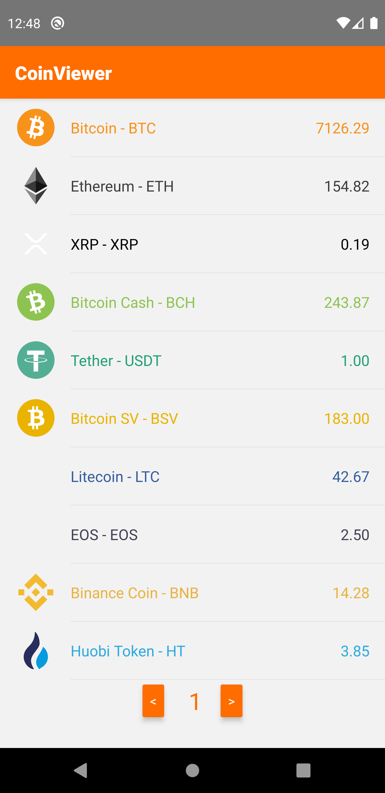
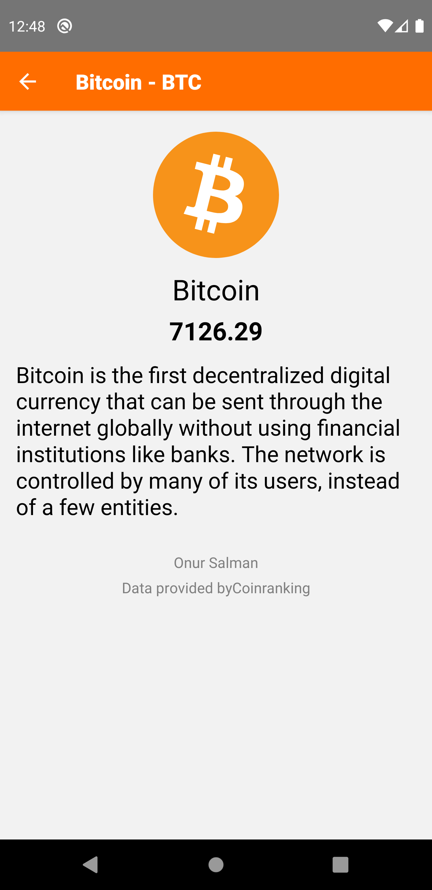

# CoinViewer
> This repo coin viewer.

## How to use
### Clone
- Clone this repo to your local machine using `https://github.com/onurrsalmann/coinviewer

### Install 
```
# Install dependencies
# Or yarn install

$ npm install
```
### Run
```
# npx react-native run-android
# Launch server

$ node server
```

### Screenshots



